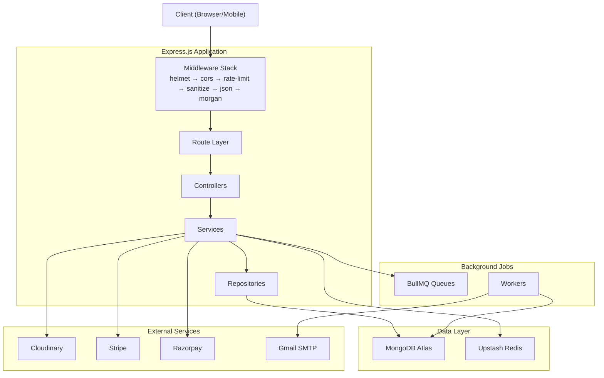

# Ecommerce Backend API — Implementation Plan

## Goal

Build a production-ready ecommerce backend API using Node.js, Express.js, and TypeScript with clean architecture (service-repository pattern), using only free-tier services.

## Tech Stack Summary

| Layer | Technology |
|-------|-----------|
| Runtime | Node.js + Express.js + TypeScript (strict) |
| Database | MongoDB Atlas (free tier) via Mongoose |
| Cache | Redis (Upstash free tier) |
| Queue | BullMQ (backed by Upstash Redis) |
| Storage | Cloudinary (free tier) |
| Email | Nodemailer (Gmail SMTP) / Resend |
| Payments | Stripe (test mode) + Razorpay (test mode) |
| Docs | Swagger UI via swagger-jsdoc + swagger-ui-express |
| Validation | Zod |
| Config | dotenv + envalid |

---

## Architecture Overview



---

## Folder Structure

```
src/
├── config/
│   ├── env.config.ts           # envalid schema + validated env export
│   ├── db.config.ts            # MongoDB connection
│   ├── redis.config.ts         # Upstash Redis client
│   ├── cloudinary.config.ts    # Cloudinary setup
│   ├── swagger.config.ts       # swagger-jsdoc options
│   └── stripe.config.ts       # Stripe client init
│   └── razorpay.config.ts     # Razorpay client init
├── modules/
│   ├── auth/
│   │   ├── auth.model.ts       # RefreshToken schema
│   │   ├── auth.dto.ts         # Zod schemas
│   │   ├── auth.repository.ts
│   │   ├── auth.service.ts
│   │   ├── auth.controller.ts
│   │   └── auth.routes.ts
│   ├── users/
│   │   ├── user.model.ts
│   │   ├── user.dto.ts
│   │   ├── user.repository.ts
│   │   ├── user.service.ts
│   │   ├── user.controller.ts
│   │   └── user.routes.ts
│   ├── products/
│   │   ├── product.model.ts
│   │   ├── product.dto.ts
│   │   ├── product.repository.ts
│   │   ├── product.service.ts
│   │   ├── product.controller.ts
│   │   └── product.routes.ts
│   ├── categories/
│   │   ├── category.model.ts
│   │   ├── category.dto.ts
│   │   ├── category.repository.ts
│   │   ├── category.service.ts
│   │   ├── category.controller.ts
│   │   └── category.routes.ts
│   ├── cart/
│   │   ├── cart.model.ts
│   │   ├── cart.dto.ts
│   │   ├── cart.repository.ts
│   │   ├── cart.service.ts
│   │   ├── cart.controller.ts
│   │   └── cart.routes.ts
│   ├── wishlist/
│   │   ├── wishlist.model.ts
│   │   ├── wishlist.dto.ts
│   │   ├── wishlist.repository.ts
│   │   ├── wishlist.service.ts
│   │   ├── wishlist.controller.ts
│   │   └── wishlist.routes.ts
│   ├── orders/
│   │   ├── order.model.ts
│   │   ├── order.dto.ts
│   │   ├── order.repository.ts
│   │   ├── order.service.ts
│   │   ├── order.controller.ts
│   │   └── order.routes.ts
│   ├── payments/
│   │   ├── payment.model.ts
│   │   ├── payment.dto.ts
│   │   ├── payment.repository.ts
│   │   ├── payment.service.ts
│   │   ├── payment.controller.ts
│   │   └── payment.routes.ts
│   ├── inventory/
│   │   ├── inventory.model.ts
│   │   ├── inventory.dto.ts
│   │   ├── inventory.repository.ts
│   │   ├── inventory.service.ts
│   │   ├── inventory.controller.ts
│   │   └── inventory.routes.ts
│   ├── reviews/
│   │   ├── review.model.ts
│   │   ├── review.dto.ts
│   │   ├── review.repository.ts
│   │   ├── review.service.ts
│   │   ├── review.controller.ts
│   │   └── review.routes.ts
│   ├── coupons/
│   │   ├── coupon.model.ts
│   │   ├── coupon.dto.ts
│   │   ├── coupon.repository.ts
│   │   ├── coupon.service.ts
│   │   ├── coupon.controller.ts
│   │   └── coupon.routes.ts
│   ├── notifications/
│   │   ├── notification.model.ts
│   │   ├── notification.dto.ts
│   │   ├── notification.repository.ts
│   │   ├── notification.service.ts
│   │   ├── notification.controller.ts
│   │   └── notification.routes.ts
│   ├── admin/
│   │   ├── admin.service.ts
│   │   ├── admin.controller.ts
│   │   └── admin.routes.ts
│   └── vendors/
│       ├── vendor.model.ts
│       ├── vendor.dto.ts
│       ├── vendor.repository.ts
│       ├── vendor.service.ts
│       ├── vendor.controller.ts
│       └── vendor.routes.ts
├── shared/
│   ├── middlewares/
│   │   ├── auth.middleware.ts       # JWT verification
│   │   ├── rbac.middleware.ts       # Role-based access
│   │   ├── error-handler.middleware.ts
│   │   ├── rate-limiter.middleware.ts
│   │   ├── validate.middleware.ts   # Zod validation
│   │   ├── audit-logger.middleware.ts
│   │   └── upload.middleware.ts     # Multer + Cloudinary
│   ├── utils/
│   │   ├── response.util.ts        # sendSuccess / sendError helpers
│   │   ├── async-wrapper.util.ts   # catchAsync HOF
│   │   ├── token.util.ts           # JWT sign/verify helpers
│   │   ├── pagination.util.ts      # Cursor/offset pagination
│   │   ├── email.util.ts           # Nodemailer transporter
│   │   ├── hash.util.ts            # bcryptjs helpers
│   │   └── slug.util.ts            # Slug generation
│   ├── types/
│   │   ├── express.d.ts            # Augment Express Request
│   │   ├── enums.ts                # Role, OrderStatus, PaymentStatus, etc.
│   │   └── interfaces.ts           # Shared interfaces
│   └── jobs/
│       ├── queues.ts               # Queue definitions
│       ├── email.worker.ts         # Email job processor
│       ├── order.worker.ts         # Order post-processing
│       └── notification.worker.ts  # In-app notification persistence
├── app.ts                          # Express app setup + middleware
└── server.ts                       # Entry point, DB connect, graceful shutdown
```

Root files:
```
├── .env.example
├── .eslintrc.json
├── .dockerignore
├── .gitignore
├── Dockerfile
├── docker-compose.yml
├── .github/workflows/ci.yml
├── tsconfig.json
├── package.json
├── jest.config.ts
└── README.md
```

---

## Proposed Changes — Execution Order

### Phase 1: Project Foundation

#### [NEW] package.json
- All dependencies: express, mongoose, ioredis, bullmq, zod, bcryptjs, jsonwebtoken, cloudinary, multer, stripe, razorpay, nodemailer, helmet, cors, express-rate-limit, sanitize-html, morgan, swagger-jsdoc, swagger-ui-express, dotenv, envalid, http-status-codes
- Dev dependencies: typescript, ts-node-dev, @types/*, eslint, jest, ts-jest, @types/jest, supertest
- Scripts: dev, build, start, lint, test, typecheck

#### [NEW] tsconfig.json
- Strict mode enabled, ES2020 target, moduleResolution: node, paths alias for `@/`

#### [NEW] .eslintrc.json
- TypeScript ESLint config with recommended rules, no `any` allowed

#### [NEW] .gitignore
- node_modules, dist, .env, coverage

#### [NEW] .env.example
- All environment variables grouped by service

---

### Phase 2: Config Layer

#### [NEW] src/config/env.config.ts
- envalid schema with all env vars typed and validated

#### [NEW] src/config/db.config.ts
- Mongoose connection with retry logic, event listeners

#### [NEW] src/config/redis.config.ts
- IORedis client for Upstash with TLS

#### [NEW] src/config/cloudinary.config.ts
- Cloudinary v2 config

#### [NEW] src/config/stripe.config.ts
- Stripe client initialization

#### [NEW] src/config/razorpay.config.ts
- Razorpay instance initialization

#### [NEW] src/config/swagger.config.ts
- swagger-jsdoc options with Bearer auth scheme

---

### Phase 3: Shared Layer

#### [NEW] src/shared/types/enums.ts
- Role (Admin, Vendor, Customer), OrderStatus, PaymentStatus, PaymentProvider, CouponType, NotificationType

#### [NEW] src/shared/types/interfaces.ts
- IPaginationQuery, IPaginatedResponse, IApiResponse, IApiError, ITokenPayload

#### [NEW] src/shared/types/express.d.ts
- Augment Express Request with `user` property

#### [NEW] src/shared/utils/response.util.ts
- `sendSuccess(res, statusCode, message, data?, pagination?)`
- `sendError(res, statusCode, message, errors?)`

#### [NEW] src/shared/utils/async-wrapper.util.ts
- `catchAsync(fn)` — wraps async route handlers

#### [NEW] src/shared/utils/token.util.ts
- `generateAccessToken()`, `generateRefreshToken()`, `verifyToken()`

#### [NEW] src/shared/utils/pagination.util.ts
- Offset pagination helper, cursor pagination helper

#### [NEW] src/shared/utils/email.util.ts
- Nodemailer transporter factory, `sendEmail()` helper

#### [NEW] src/shared/utils/hash.util.ts
- `hashPassword()`, `comparePassword()`

#### [NEW] src/shared/utils/slug.util.ts
- `generateSlug()` with uniqueness suffix

---

### Phase 4: Middleware Stack

#### [NEW] src/shared/middlewares/auth.middleware.ts
- Extract JWT from cookies/Authorization header, verify, attach user to `req.user`

#### [NEW] src/shared/middlewares/rbac.middleware.ts
- `authorize(...roles)` — check `req.user.role` against allowed roles

#### [NEW] src/shared/middlewares/validate.middleware.ts
- Generic Zod validation middleware for body, query, params

#### [NEW] src/shared/middlewares/error-handler.middleware.ts
- Centralized error handler: Mongoose validation errors, Zod errors, JWT errors, custom `AppError`

#### [NEW] src/shared/middlewares/rate-limiter.middleware.ts
- Global rate limiter + factory for per-route limiters

#### [NEW] src/shared/middlewares/audit-logger.middleware.ts
- Log POST/PUT/PATCH/DELETE to AuditLog collection

#### [NEW] src/shared/middlewares/upload.middleware.ts
- Multer memory storage + Cloudinary upload helper

---

### Phase 5: Database Models (14 Mongoose Models)

All models with `timestamps: true` and proper indexes.

| Model | Key Fields | Indexes |
|-------|-----------|---------|
| User | name, email, password, role, avatar, addresses, isVerified | email (unique) |
| RefreshToken | token, userId, expiresAt, isRevoked, replacedBy | token, userId |
| Product | name, slug, description, price, images, category, vendor, avgRating | slug (unique), category, vendor, price, text(name,description) |
| Category | name, slug, parent, level | slug (unique), parent |
| Cart | user, items[{product, quantity, price}], coupon, totalPrice | user (unique) |
| Wishlist | user, products[] | user (unique) |
| Order | user, items, shippingAddress, status, totalAmount, payment | user, status |
| Payment | order, user, provider, providerPaymentId, amount, status | order, providerPaymentId |
| Inventory | product, variant, quantity, lowStockThreshold | product |
| Review | user, product, rating, comment, isVerifiedPurchase | product, user (compound unique) |
| Coupon | code, type, value, minOrderAmount, maxUses, usedCount, expiresAt, perUserLimit | code (unique) |
| Notification | user, type, title, message, isRead | user, isRead |
| AuditLog | user, action, resource, resourceId, details, ip | user, resource |
| Vendor | user, businessName, description, isApproved, commission | user (unique) |

---

### Phase 6: Feature Modules (14 modules)

Each module follows this pattern:
- **DTO** — Zod schemas for create, update, query params
- **Repository** — Data access layer (Mongoose queries)
- **Service** — Business logic (calls repository, external services, queues)
- **Controller** — HTTP layer (parse request, call service, send response)
- **Routes** — Express router with middleware + Swagger JSDoc annotations

#### Module: Auth
- POST `/api/v1/auth/register` — Register customer/vendor
- POST `/api/v1/auth/login` — Login, set HTTP-only cookies
- POST `/api/v1/auth/logout` — Revoke refresh token, clear cookies
- POST `/api/v1/auth/refresh` — Rotate refresh token with reuse detection
- POST `/api/v1/auth/verify-email/:token` — Email verification
- POST `/api/v1/auth/forgot-password` — Send reset link
- POST `/api/v1/auth/reset-password/:token` — Reset password

#### Module: Users
- GET `/api/v1/users/me` — Get profile
- PUT `/api/v1/users/me` — Update profile
- PUT `/api/v1/users/me/avatar` — Upload avatar (Cloudinary)
- POST `/api/v1/users/me/addresses` — Add address
- PUT `/api/v1/users/me/addresses/:addressId` — Update address
- DELETE `/api/v1/users/me/addresses/:addressId` — Delete address
- GET `/api/v1/users` — Admin: List all users
- GET `/api/v1/users/:id` — Admin: Get user by ID

#### Module: Products
- POST `/api/v1/products` — Vendor/Admin: Create product
- GET `/api/v1/products` — Public: List with search, filters, sort, pagination
- GET `/api/v1/products/:slug` — Public: Get by slug
- PUT `/api/v1/products/:id` — Vendor/Admin: Update product
- DELETE `/api/v1/products/:id` — Vendor/Admin: Delete product
- POST `/api/v1/products/:id/images` — Upload images

#### Module: Categories
- POST `/api/v1/categories` — Admin: Create category
- GET `/api/v1/categories` — Public: List all (tree structure)
- GET `/api/v1/categories/:slug` — Public: Get by slug
- PUT `/api/v1/categories/:id` — Admin: Update
- DELETE `/api/v1/categories/:id` — Admin: Delete

#### Module: Cart
- GET `/api/v1/cart` — Get user's cart
- POST `/api/v1/cart/items` — Add item
- PUT `/api/v1/cart/items/:productId` — Update quantity
- DELETE `/api/v1/cart/items/:productId` — Remove item
- POST `/api/v1/cart/coupon` — Apply coupon
- DELETE `/api/v1/cart/coupon` — Remove coupon
- DELETE `/api/v1/cart` — Clear cart

#### Module: Wishlist
- GET `/api/v1/wishlist` — Get wishlist
- POST `/api/v1/wishlist/:productId` — Add product
- DELETE `/api/v1/wishlist/:productId` — Remove product
- POST `/api/v1/wishlist/:productId/move-to-cart` — Move to cart

#### Module: Orders
- POST `/api/v1/orders` — Place order (with transaction)
- GET `/api/v1/orders` — User: order history
- GET `/api/v1/orders/:id` — Get order details
- PUT `/api/v1/orders/:id/cancel` — Cancel order
- PUT `/api/v1/orders/:id/status` — Admin/Vendor: Update status

#### Module: Payments
- POST `/api/v1/payments/stripe/checkout` — Create Stripe Checkout Session
- POST `/api/v1/payments/razorpay/order` — Create Razorpay Order
- POST `/api/v1/payments/stripe/webhook` — Stripe webhook handler
- POST `/api/v1/payments/razorpay/webhook` — Razorpay webhook handler
- GET `/api/v1/payments/:orderId` — Get payment status

#### Module: Inventory
- GET `/api/v1/inventory/:productId` — Get stock info
- PUT `/api/v1/inventory/:productId` — Update stock (Admin/Vendor)
- GET `/api/v1/inventory/low-stock` — Get low-stock alerts (Admin/Vendor)

#### Module: Reviews
- POST `/api/v1/reviews/:productId` — Create review (verified purchase only)
- GET `/api/v1/reviews/:productId` — Get product reviews
- PUT `/api/v1/reviews/:id` — Update own review
- DELETE `/api/v1/reviews/:id` — Delete own review / Admin delete

#### Module: Coupons
- POST `/api/v1/coupons` — Admin: Create coupon
- GET `/api/v1/coupons` — Admin: List coupons
- GET `/api/v1/coupons/:code` — Validate coupon
- PUT `/api/v1/coupons/:id` — Admin: Update
- DELETE `/api/v1/coupons/:id` — Admin: Delete

#### Module: Notifications
- GET `/api/v1/notifications` — Get user notifications
- PUT `/api/v1/notifications/:id/read` — Mark as read
- PUT `/api/v1/notifications/read-all` — Mark all as read
- DELETE `/api/v1/notifications/:id` — Delete notification

#### Module: Admin
- GET `/api/v1/admin/dashboard` — Dashboard stats (revenue, orders, users, products)
- GET `/api/v1/admin/users` — Manage users
- PUT `/api/v1/admin/users/:id/role` — Change user role
- GET `/api/v1/admin/orders` — All orders
- GET `/api/v1/admin/analytics/revenue` — Revenue analytics

#### Module: Vendors
- POST `/api/v1/vendors/apply` — Apply for vendor
- GET `/api/v1/vendors/me` — Vendor profile
- PUT `/api/v1/vendors/me` — Update vendor profile
- GET `/api/v1/vendors/me/products` — Vendor products
- GET `/api/v1/vendors/me/analytics` — Sales analytics
- GET `/api/v1/vendors` — Admin: List vendors
- PUT `/api/v1/vendors/:id/approve` — Admin: Approve vendor

---

### Phase 7: BullMQ Queues & Workers

#### [NEW] src/shared/jobs/queues.ts
- Define `emailQueue`, `orderQueue`, `notificationQueue`
- Default retry: 3 attempts, exponential backoff
- Dead-letter queue config

#### [NEW] src/shared/jobs/email.worker.ts
- Process: welcome email, order confirmation, password reset, low-stock alert

#### [NEW] src/shared/jobs/order.worker.ts
- Process: inventory deduction, send confirmation email, create notification

#### [NEW] src/shared/jobs/notification.worker.ts
- Process: persist in-app notifications to DB

---

### Phase 8: App & Server Entry

#### [NEW] src/app.ts
- Express app creation
- Middleware stack in order: helmet → cors → rate-limit → sanitize → json → morgan → audit logger
- Mount all module routes under `/api/v1`
- Swagger UI at `/api/docs`
- Health check at `/api/health`
- 404 handler
- Global error handler (last)

#### [NEW] src/server.ts
- Connect to MongoDB
- Initialize Redis
- Start BullMQ workers
- Start HTTP server
- Graceful shutdown (SIGTERM, SIGINT)

---

### Phase 9: DevOps

#### [NEW] Dockerfile
- Multi-stage build: builder (install deps + compile TS) → production (copy dist + node_modules)

#### [NEW] docker-compose.yml
- Services: app, mongo, redis (for local dev)

#### [NEW] .dockerignore

#### [NEW] .github/workflows/ci.yml
- Steps: checkout → setup-node → install → typecheck → lint → test → build → docker build

---

### Phase 10: Documentation

#### [MODIFY] README.md
- Architecture overview, setup instructions, API reference, environment variables

---

## Open Questions

> [!IMPORTANT]
> **Email Service**: The plan includes both Gmail SMTP and Resend as options. Should I default to Gmail SMTP (simpler setup, no signup needed) and mention Resend as an alternative? Or should I implement both with a strategy pattern?

> [!IMPORTANT]  
> **Test Coverage**: Given the scope (14 modules), should I include unit tests for all modules, or focus on integration tests for critical paths (auth, orders, payments) and add unit tests for utilities/services only?

> [!NOTE]
> **Razorpay NPM Package**: The official `razorpay` npm package has TypeScript types but they can be incomplete. I'll use it with supplementary type declarations where needed.

---

## Verification Plan

### Automated Tests
```bash
# TypeScript type check
npx tsc --noEmit

# Lint check
npx eslint src/ --ext .ts

# Run tests
npm test

# Build
npm run build

# Docker build
docker build -t ecommerce-api .
```

### Manual Verification
- Start the dev server and verify:
  - `GET /api/health` returns status with DB and Redis connection info
  - `GET /api/docs` loads Swagger UI with all endpoints documented
  - Auth flow: register → verify email → login → refresh → logout
  - All module routes are mounted and respond correctly
